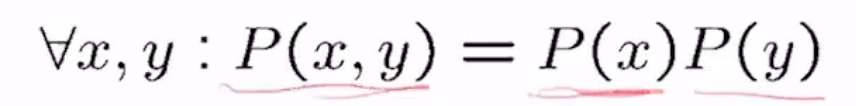
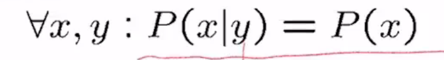
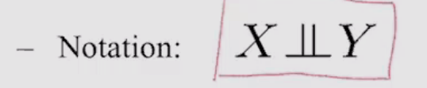

# March 2 - Lecture 13 - Naive Bayesian Classifier

# Independence

Two variables are _independent_ if:
	
	- the joint distribution factors into a product two simpler distributions
	- another form
		
	- notation
		

## Example: Independence
Empirical joint distributions: at best "close" to independent

A and B are independt iff

P(A|B) = P(A) &or; P(B|A) = P(B) &or; P(A, B) = P(A)P(B)

P(Toothache, Catch, Cavity, Weather) = P(Toothache, Catch, Cavity) P(Weather)
